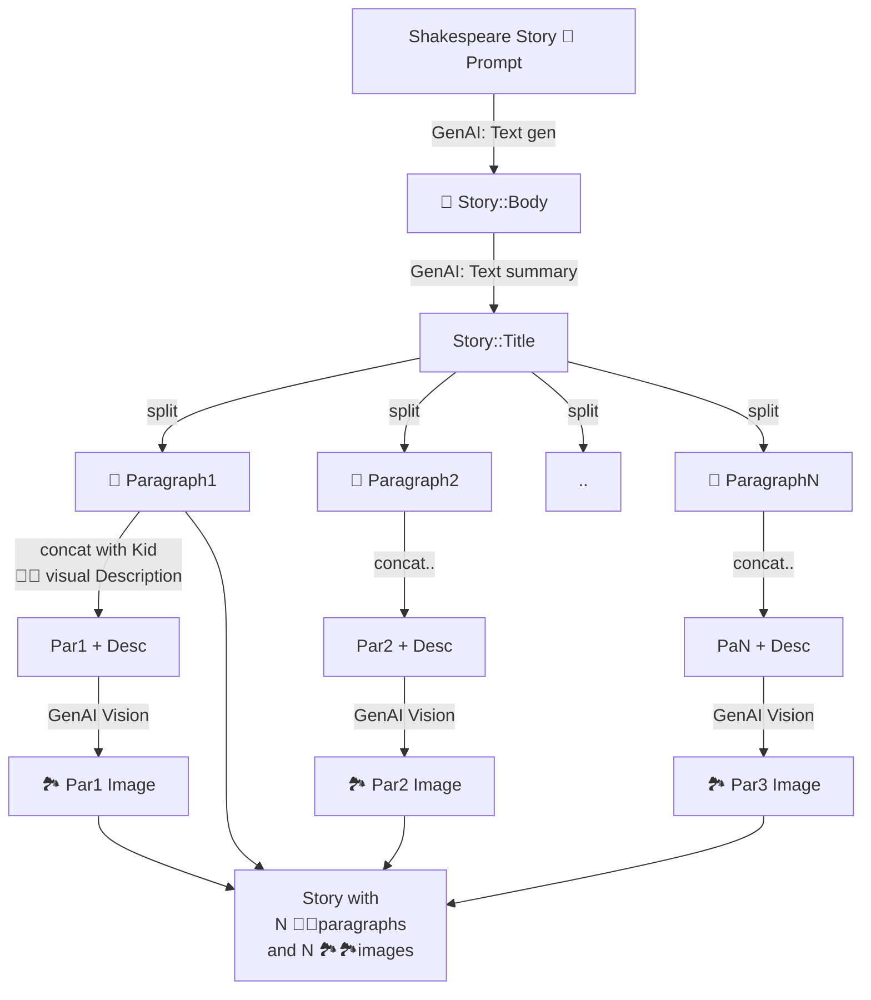

# README

This is an OSS demo of how to get GenAI to work with Google Cloud.

Google Cloud tech stack:

* **Cloud Run** (to run the container - currently [here](https://genai-kids-stories-gcloud-poor-cdlu26pd4q-ew.a.run.app/))
* **Cloud Build** (to automate a new build at every commit! We're serious and lazy here!)
* **Vertex AI** GenAI used for:
  * Generating long text (story ideation)
  * Summarization (auto-title! So sweet)
  * Image generation (a different pic per paragraph)
* **Google Translate API** to generate a story in A number of languages: 🇮🇹🇧🇷🇪🇸🇫🇷🇨🇳🇷🇺 .. This is the only consumer API used, with an API key
* **Text to Speech API** to generate an Audio ([italian sample](https://genai-kids-stories-gcloud-poor-cdlu26pd4q-ew.a.run.app/rails/active_storage/blobs/redirect/eyJfcmFpbHMiOnsibWVzc2FnZSI6IkJBaHBBdW9NIiwiZXhwIjpudWxsLCJwdXIiOiJibG9iX2lkIn19--4e9d219009350ff1d234ac1edd75b6eb1f8fd3af/tmp-speech.mp3?disposition=attachment))
* **Google Cloud Storage** for ActiveStorage (images and sounds are stored in a GCS bucket)
* **Secrets Manager** to hold my app most precious untold secrets: `RAILS_MASTER_KEY` , `TRANSLATE_API_KEY`, and `service_account_key.json`. Actually if You find them in the code, please tell me, as I'm not infallible. I promise you *Italian* gratitude.

Boring details:

* Ruby version: `3.2.0`
* Rails version: `7.0.6`
* Frontend: `Bootstrap 5`.
* System dependencies: see `make install`
* Database: `PostgreS`
* `ActiveStorage`: backend on Google Cloud Storage
* `DelayedJob` for job queue (using `PGSQL` DB , not Redis like most humans - I've just been lazy).
* `direnv` to manage 🌱 `.envrc` and friends. You can create a `.envrc.$USER` file and it will be auto-slurped by my awesome scripts.

# GCP Architecture

This is a simplified architecture of the Google Cloud components used:

# App Architecture

This is how it works (thanks [Mermaid](https://mermaid.js.org/) and [stackedit](https://stackedit.io/app#) ):

# INSTALL

* make sure you create yur own `.envrc.yourname` and assign the ENV vars you want.
* Create A svcAcct for GCS and download it under `private/sa.json`. Do NOT check it in :)
* Create your own `RAILS_MASTER_KEY` and keep it aside.
* Environments:
  * `make dev`: runs in `development`, with sqlite3 db and local storage
  * `make dev-on-gcp`: run in pseudo-dev, but with pgsql DB (and GCS storage)
  * `make prod`: run in prod, with pgsql DB (and GCS storage)

# RUN

* `make reauth-local` ensures the
* make dev # or whatever ENV you want to run. Check Makefile for some options

## Build on Google

* Cloud Build (on ricc project `ror-goldie`).
* manually created build with:

1. `_RAILS_MASTER_KEY` set to `cat config/master.key`
2. `_DANGEROUS_SA_JSON_VALUE` set to `cat private/sa.json`

## Ruby docs

Ruby (and Rails):

* [Net HTTP](https://docs.ruby-lang.org/en/2.0.0/Net/HTTP.html)
* [ActiveStorage](https://guides.rubyonrails.org/active_storage_overview.html#attaching-file-io-objects)
* [Ruby Singleton](https://refactoring.guru/design-patterns/singleton/ruby/example)

Google

* [Google OAuth Playground](https://developers.google.com/oauthplayground/)

This app

* [PROD App](https://genai-kids-stories-gcloud-poor-cdlu26pd4q-ew.a.run.app/) (poor).
* [Slides](https://docs.google.com/presentation/d/1031Ligtdpz8dyF-186b7LrVToq7N9nxXZ1kMbPzpjIg/edit)
* Article: WIP.
