# README

Things you may want to cover:

* Ruby version: `3.2.0`
* Rails version: `7.0.6`
* System dependencies: see `make install`
* Database creation
* Database initialization
* How to run the test suite
* Services: `delayed_job` job queues.
* ...

# Architecture

This is how it works (thanks [Mermaid](https://mermaid.js.org/) and [stackedit](https://stackedit.io/app#) ):

```mermaid
flowchart TD;


    A2["Shakespeare Story 🥚 Prompt"] -- GenAI: Text gen --> B["📖 Story::Body"];
    B -- GenAI: Text summary --> C[Story::Title];
    C -- split --> P1["📜 Paragraph1"];
    C -- split --> P2["📜 Paragraph2"];
    C -- split --> Pdot[..];
    C -- split --> P3["📜 ParagraphN"];

    P1 -- "concat with Kid\n👶🏾 visual Description" --> PD1["Par1 + Desc"];
    P2 -- concat.. --> PD2[Par2 + Desc];
    P3 -- concat.. --> PD3[PaN + Desc];

    PD1 -- GenAI Vision --> IMG1["🏞️ Par1 Image"];
    PD2 -- GenAI Vision --> IMG2["🏞️ Par2 Image"];
    PD3 -- GenAI Vision --> IMG3["🏞️ Par3 Image"];

    IMG1 --> END["Story with \n N 📜📜paragraphs \n and N 🏞️🏞️images"]
    IMG2 --> END
    IMG3 --> END
    P1 --> END;
```



# INSTALL

* make sure you create yur own .enrc.yourname and assign the ENV vars you want
* Create A svcAcct for GCS and download it under `private/sa.json`. do NOT check it in :)

# Entities

```bash
# Generation
rails g scaffold kids name:string surname:string nick:string visual_description:string \
    is_male:boolean date_of_birth:date internal_info:text user_id:integer
rails active_storage:install
 rails g migration add_avatar_to_kid  avatar:attachment

# note the integer vs reference is neaerly the same behaviour: https://stackoverflow.com/questions/7861971/generate-model-in-rails-using-user-idinteger-vs-userreferences
rails g scaffold Story title:string \
    genai_input:text genai_output:text genai_summary:text \
    internal_notes:text \
    user_id:integer kid:references \
    --force

# dont add 'cover_image:attachment'
# or      images:attachment \

 rails g controller page_controller index about help

rails g scaffold StoryParagraph \
     story_index:integer \
     original_text:text \
     genai_input_for_image:text \
     internal_notes:text \
     translated_text:text \
     language:string \
     story:references \
     rating:integer

rails g scaffold --force StoryTemplate \
    short_code:string \
    description:string \
    template:text \
    internal_notes:text \
    user_id:integer

rails g scaffold  --force TranslatedStory \
    name:string \
    user:references \
    story:references \
    language:string \
    kid_id:integer:index \
    paragraph_strategy:string \
    internal_notes:text \
    genai_model:string

rails g migration addTranslatedStoryReferenceToStoryParagraph \
    translated_story:references

rails g migration addFavoriteLangugageToKid \
    favorite_language:string

rails g migration addNameToUser \
    name:string # and added internal notes too.

Now fix once for all:
$ StoryParagraph.all.map{|sp| sp.story_id}.uniq.each do
    Create StoryParagraph  t.c. ...

rails g migration addTranslatedTitleToTranslatedStory
    translated_title:string

rails g migration addActiveToStory active:boolean
```

## Build on Google

* Cloud Build (on ricc project `ror-goldie`).
* manually created build with:

1. `_RAILS_MASTER_KEY` set to `cat config/master.key`
2. `_DANGEROUS_SA_JSON_VALUE` set to `cat private/sa.json`

## Dockerization from M1

According to https://beebom.com/how-fix-exec-user-process-caused-exec-format-error-linux/ :

`docker buildx build --platform=linux/amd64 -t <image_name>:<version>-amd64 .`

Then update your Docker file’s “FROM” statement using this syntax:

`FROM --platform=linux/amd64 <base_image>:<version>`

Not sure its that easy but.. happy to try someday.

## Ruby docs

Ruby (and Rails):

* [Net HTTP](https://docs.ruby-lang.org/en/2.0.0/Net/HTTP.html)
* [ActiveStorage](https://guides.rubyonrails.org/active_storage_overview.html#attaching-file-io-objects)
* [Ruby Singleton](https://refactoring.guru/design-patterns/singleton/ruby/example)

Google

* [Google OAuth Playground](https://developers.google.com/oauthplayground/)

This app

* [PROD App](https://genai-kids-stories-gcloud-cdlu26pd4q-uc.a.run.app/)
